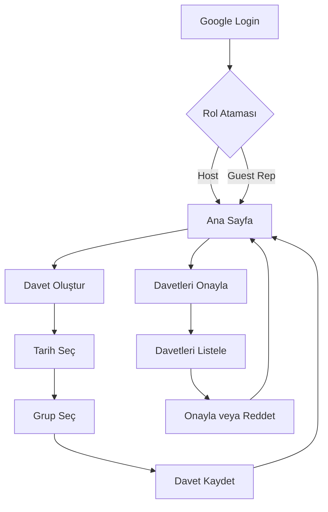

## 1. Product Overview
Ramazan iftar daveti eşleştirme sistemi - host'ların guest grupları ile iftar daveti organize etmesini sağlayan platform. Hostlar tarih ve grup seçerek davet oluşturur, temsilciler davetleri onaylar.

## 2. Core Features

### 2.1 User Roles

| Rol | Kayıt Yöntemi | Temel Yetkiler |
|-----|---------------|---------------|
| Host | Google Login ile kayıt | İftar daveti oluşturma, kendi davetlerini görüntüleme |
| Guest Group Representative | Google Login ile kayıt | Grubuna gelen davetleri görüntüleme ve onaylama |

### 2.2 Feature Module
Uygulamamızın temel sayfaları:

1. **Ana Sayfa:** 30 günlük Ramazan takvimi, günlerin durum gösterimi, navigasyon
2. **Host Sayfası:** Tarih seçimi, grup seçimi, davet oluşturma formu
3. **Confirm Sayfası:** Bekleyen davetler listesi, onay/ret işlemleri

### 2.3 Sayfa Detayları

| Sayfa Adı | Modül Adı | Özellik açıklaması |
|-----------|-----------|-------------------|
| Ana Sayfa | Ramazan Takvimi | 30 günlük takvim gösterimi, günlerin durum rengi (Empty=Boş, Pending=Beklemede, Accepted=Kabul Edilmiş), günlere tıklama ile detay görünümü |
| Ana Sayfa | Navigasyon | Kullanıcı rolüne göre Host Sayfası veya Confirm Sayfası linkleri, logout butonu |
| Host Sayfası | Tarih Seçimi | Ramazan tarihlerinden birini seçme, dolu tarihlerin disabled olması |
| Host Sayfası | Grup Seçimi | 5 pre-defined gruptan birini seçme (dropdown veya radio button) |
| Host Sayfası | Davet Oluşturma | Seçilen tarih ve grup ile davet kaydını oluşturma, başarılı mesajı, form validasyonu |
| Confirm Sayfası | Davet Listesi | Kullanıcının temsil ettiği gruba gelen bekleyen davetleri listeleme, tarih, host bilgisi gösterme |
| Confirm Sayfası | Onay İşlemleri | Daveti kabul etme veya ret etme, işlemden sonra listenin güncellenmesi |

## 3. Core Process

**Host Akışı:**
1. Kullanıcı Google ile giriş yapar
2. Host rolü atanır
3. Ana sayfadan "Davet Oluştur" seçeneğine tıklar
4. Tarih seçer (boş tarihler)
5. Guest grubu seçer
6. Daveti gönderir
7. Takvimde tarih "Pending" durumuna geçer

**Guest Group Representative Akışı:**
1. Kullanıcı Google ile giriş yapar
2. Guest Group Representative rolü atanır
3. Ana sayfadan "Davetleri Onayla" seçeneğine tıklar
4. Grubuna gelen bekleyen davetleri görür
5. Daveti onaylar veya reddeder
6. Takvimde tarih "Accepted" veya "Empty" durumuna geçer

## 4. Kullanıcı Arayüzü Tasarımı

### 4.1 Tasarım Tarzı
- **Ana Renkler:** Ramazan teması - Koyu yeşil (#166534), Altın sarısı (#fbbf24), Beyaz (#ffffff)
- **Buton Stili:** Rounded corners (rounded-lg), modern, hafif gölge
- **Font:** Inter veya sans-serif, başlıklar için 18-24px, metin için 14-16px
- **Layout:** Card-based tasarım, temiz ve minimal
- **Durum Renkleri:** Empty=Gri, Pending=Sarı, Accepted=Yeşil

### 4.2 Page Design Overview

| Sayfa Adı | Modül Adı | UI Elements |
|-----------|-----------|-------------|
| Ana Sayfa | Ramazan Takvimi | Grid layout (6 sütun, 5 satır), her gün bir card, durum rengi border, tarih numarası, hover efekti |
| Ana Sayfa | Navigasyon | Top navigation bar, logo sol tarafta, sağ tarafta rol tabanlı menü ve logout butonu |
| Host Sayfası | Tarih Seçimi | Calendar widget veya grid selector, disabled tarihler gri, seçili tarih vurgulu |
| Host Sayfası | Grup Seçimi | Dropdown veya radio button listesi, grup isimleri açık, seçim anında highlight |
| Host Sayfası | Davet Oluşturma | Form container, submit butonu altta, başarılı işlem sonrası toast notification |
| Confirm Sayfası | Davet Listesi | Vertical list, her davet bir card, tarih ve host bilgisi, onay/ret butonları yan yana |

### 4.3 Duyarlılık
- Mobile-first yaklaşım
- Takvim grid mobilde 2 sütun, tablette 3 sütun, masaüstünde 6 sütun
- Touch interaction optimize (buton min-height 44px)
- Responsive navigation (hamburger menu mobilde)
