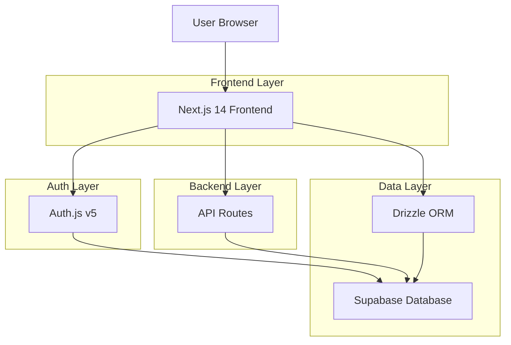
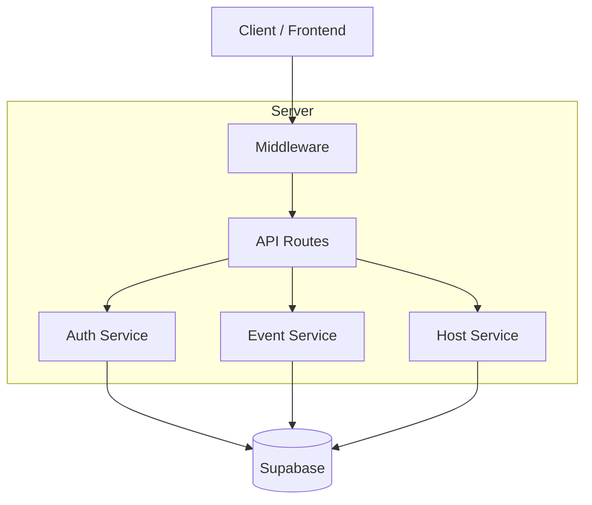
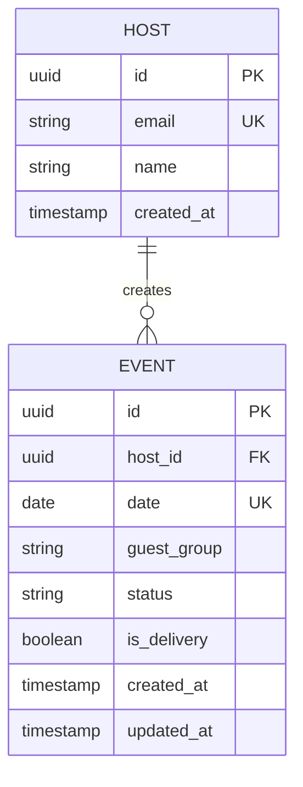

## 1.Architecture design



## 2. Teknoloji Açıklaması
- **Frontend:** Next.js 14+ (App Router) + TypeScript + Tailwind CSS
- **Backend:** Next.js API Routes (built-in)
- **Database:** Supabase (PostgreSQL)
- **ORM:** Drizzle ORM
- **Authentication:** Auth.js (NextAuth v5) - Google Provider only
- **State Management:** React Context / Server Components

## 3. Rota Tanımları

| Route | Purpose |
|-------|---------|
| / | Ana sayfa, 30 günlük Ramazan takvimi gösterimi |
| /host | Host sayfası, iftar daveti oluşturma |
| /confirm | Guest representative sayfası, davet onaylama |
| /auth/signin | Google login sayfası (Auth.js) |
| /api/auth/[...nextauth] | Auth.js callback handler |
| /api/events/* | Event CRUD operations |
| /api/hosts/* | Host CRUD operations |

## 4.API definitions

### 4.1 Authentication API

Google OAuth callback
```
GET /api/auth/callback/google
```

Session kontrol
```
GET /api/auth/session
```

### 4.2 Events API

Davet oluşturma (Host)
```
POST /api/events
```

Request:
| Param Name | Param Type | isRequired | Description |
|------------|------------|------------|-------------|
| date | string | true | Ramazan tarihi (YYYY-MM-DD formatı) |
| guest_group | string | true | Guest grup adı |
| is_delivery | boolean | false | Teslimat durumu (Kız Öğrenci Evi için true) |

Response:
| Param Name | Param Type | Description |
|------------|------------|-------------|
| id | string | Oluşturulan event ID |
| status | string | "pending" |
| message | string | İşlem sonucu mesajı |

Bekleyen davetleri getirme (Guest Rep)
```
GET /api/events/pending?group=:group_name
```

Response:
```json
{
  "events": [
    {
      "id": "uuid",
      "date": "2025-03-01",
      "guest_group": "Kız Öğrenci Evi",
      "host_id": "uuid",
      "status": "pending",
      "is_delivery": true
    }
  ]
}
```

Davet onaylama
```
PUT /api/events/:id/accept
```

Davet reddetme
```
PUT /api/events/:id/reject
```

### 4.3 Hosts API

Host bilgisi getirme
```
GET /api/hosts/me
```

## 5. Sunucu Mimarisi Diyagramı



## 6.Data model

### 6.1 Data model definition



### 6.2 Veri Tanımlama Dili

Host Table (hosts)
```
-- create table
CREATE TABLE hosts (
    id UUID PRIMARY KEY DEFAULT gen_random_uuid(),
    email VARCHAR(255) UNIQUE NOT NULL,
    name VARCHAR(100) NOT NULL,
    created_at TIMESTAMP WITH TIME ZONE DEFAULT NOW()
);

-- create index
CREATE INDEX idx_hosts_email ON hosts(email);
```

Events Table (events)
```
-- create table
CREATE TABLE events (
    id UUID PRIMARY KEY DEFAULT gen_random_uuid(),
    host_id UUID NOT NULL REFERENCES hosts(id) ON DELETE CASCADE,
    date DATE NOT NULL,
    guest_group VARCHAR(100) NOT NULL,
    status VARCHAR(20) DEFAULT 'pending' CHECK (status IN ('pending', 'accepted', 'rejected', 'cancelled')),
    is_delivery BOOLEAN DEFAULT false,
    created_at TIMESTAMP WITH TIME ZONE DEFAULT NOW(),
    updated_at TIMESTAMP WITH TIME ZONE DEFAULT NOW(),
    UNIQUE(date)
);

-- create index
CREATE INDEX idx_events_date ON events(date);
CREATE INDEX idx_events_host_id ON events(host_id);
CREATE INDEX idx_events_guest_group ON events(guest_group);
CREATE INDEX idx_events_status ON events(status);
```

-- init data (guest groups as enum values, not table)
-- Guest groups: 'Muaz Ailesi', 'Erhan Ailesi', 'Erkek Öğrenci Evi', 'Yalnız Muhacir Erkek Arkadaşlar', 'Kız Öğrenci Evi'
